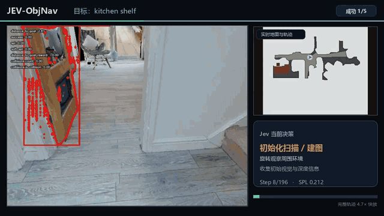
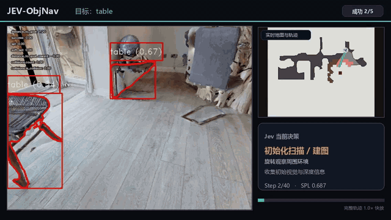
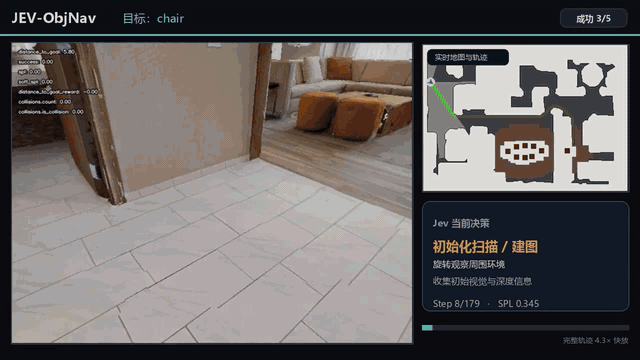
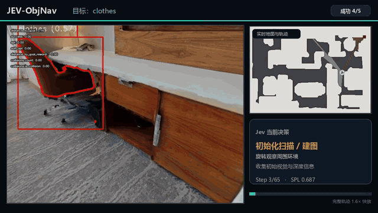
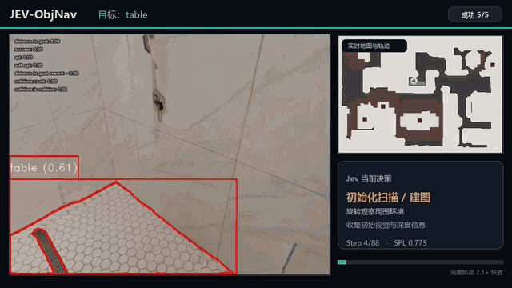

# JEV-ObjNav

JEV-ObjNav 是一个把 **Jev 决策模型接入开放词汇目标导航**的研究项目。系统在本地完成视觉感知、地图维护、候选生成、路径规划和动作执行，只把适合语言模型理解的结构化导航状态交给 Jev。Jev 不直接生成坐标或控制指令，而是在规划器已经验证安全、可达的选项中决定：继续探索，还是接近某个目标候选。

## 方法概览

```text
RGB-D 观测
  ├─ 目标检测、分割、图文匹配
  ├─ 占用地图 + 语义价值地图 + 对象地图
  ├─ 前沿、对象和可达路径
  └─ 区域图摘要
       ├─ 区域、对象、前沿与稀疏可达关系
       ├─ 机器人状态、历史进展与视觉证据
       └─ 本地验证过的有限选项
                         ↓
                   Jev 选择 option ID
                         ↓
            本地校验 → 执行 → 新观测 → 再决策
```

Jev 负责高层选择，本地规划器负责几何与安全。Habitat 的最短路径、目标视点等评测真值不进入在线请求。

## 从观测中提取的信息

每个导航周期取得 RGB、深度、相机位姿和目标名称。视觉服务提供开放词汇检测框、分割掩码、标签以及图像—文本匹配分数；深度与位姿把二维检测投影到空间中，并在多帧之间融合。系统维护三张互补地图：

1. **占用地图**：记录自由空间、障碍、未知区域、膨胀障碍与安全间距，供碰撞检查和路径搜索使用。
2. **语义价值地图**：把画面与目标、房间先验和相关物体的语义相关性累积到空间中，为探索区域和前沿估计价值。
3. **对象地图**：把跨帧检测融合成对象簇，维护位置、边界、类别证据、置信度、观测次数、新鲜度和多视角一致性。

地图层生成两类候选：`explore_frontier` 前往已知与未知空间的边界获取新信息；`approach_object` 接近已经观察到、且本地验证可达的目标对象。候选同时携带本地 A* 路径状态、距离、语义证据和唯一 ID。Jev 只能选择列表中的 ID，不能虚构坐标、路径或对象。

## 把三张地图变成 Jev 能理解的区域图

原始地图是高分辨率栅格、点云和持续增长的检测记录。逐像素、逐格子或逐点发送既不符合语言模型擅长的表达，也会快速超过 Jev 的上下文长度，而且大量相邻格子是重复信息。

本项目采用**有损几何摘要、完整决策证据留存**：细粒度几何留在本地，Jev 接收区域化拓扑和统计。

系统从占用地图中取已知、自由且可通行的格子，再按固定空间块和局部连通性形成区域节点；被墙隔开的空间不会因为处于同一方块而合并。每个区域维护：

- 稳定 ID、二维边界框、可通行锚点和自由面积；
- 是否访问、访问次数、最近访问步数和区域演化关系；
- 语义价值的 `mean / p90 / max / valid_area_fraction`；
- 区域内对象的中心、边界框、类别证据、置信度、观测次数和新鲜度；
- 区域内前沿的位置、语义分数、信息增益和可达状态。

区域之间只保留当前地图验证过的稀疏可达边。机器人状态包含当前区域与 `{x, y, yaw}`；候选包含目标区域、局部路径长度和 `route_region_ids`，但不包含完整路径点。

### Token 压缩规则

- 用区域边界框和统计量替代逐格地图；
- 用对象簇摘要替代检测像素和三维点；
- 用前沿中心、边界长度、价值和可达性替代前沿格子集合；
- 用稀疏区域边和区域路线替代完整路径坐标；
- 限制数值精度，但明确本地执行仍使用全精度数据；
- 保留全部安全候选，以及与决策直接相关的置信度、新鲜度、历史进展和来源阶段。

摘要的目的不是让 Jev 重建地图，而是让它理解：机器人在哪里、哪些区域已探索、哪些区域有价值、观察到了哪些对象、哪些动作现在能够执行。当前协议为 `jev-region-graph/1.1`，示例见 `examples/region_graph/`。

## Jev 决策与安全边界

桥接服务把区域图封装成 OpenRouter Decisions 请求，问题是严格的 choice：从 `options` 中选择一个 `next_goal`。返回后，Python 桥检查 schema、episode、地图版本、候选 ID 和概率；C++ 规划器再核对内存中的候选与路径，然后执行。

网络超时、429/5xx 或临时无效响应会继续请求；连续 15 次失败后，本 episode 记为技术失败，不回退到本地高层规则。到达疑似对象也不会立刻宣布成功：系统要求到达后的新鲜视觉观测与多视角证据，确认失败就屏蔽该候选并继续探索，从而减少假阳性。

## 项目结构

- `jev_obj/`：ROS/catkin 规划器、Habitat 评估、地图和视觉感知；
- `nav_jev_bridge/`：区域图校验、Jev 请求与本地 HTTP 服务；
- `tools/`：环境检查、启动、评测、审计和结果汇总；
- `tests/`：协议、区域图、感知元数据和运行审计测试；
- `examples/region_graph/`：区域图请求与响应示例；
- `docs/`：环境、配置和协议说明。

## 快速开始

```bash
conda env create -f environment.yml
conda activate jev-obj-bridge
python -m pip install -e .
python -m unittest discover -s tests -v
python -m nav_jev_bridge.cli examples/snapshot.json --provider demo
```

完整导航需要 Ubuntu 20.04、ROS Noetic、Habitat 0.3.1、HM3D/OVON 数据和四个真实视觉服务。请按 [环境与配置指南](docs/SETUP.md) 分层安装，并复制 [.env.example](.env.example) 配置本机路径。数据集、模型权重、密钥、日志、编译产物和视频默认不进入 Git。

## 真实 Jev 成功轨迹

在本轮连续 18 个测试场景中，系统成功完成 5 个场景，成功率为 **27.8%（5/18）**。以下是五条成功轨迹的独立切片：每条约 11 秒，以相同节奏循环播放，保留第一视角、在线地图、Jev 决策和导航进度。点击动图可查看对应的完整原始轨迹。

<table>
  <tr>
    <td width="50%" align="center">
      <a href="demo/five_successes/01_episode_02_kitchen_shelf.mp4"></a><br>
      <b>01 · Kitchen shelf</b><br>
      196 steps · SPL 0.212 · 151 Jev decisions
    </td>
    <td width="50%" align="center">
      <a href="demo/five_successes/02_episode_11_table.mp4"></a><br>
      <b>02 · Table</b><br>
      40 steps · SPL 0.687 · 10 Jev decisions
    </td>
  </tr>
  <tr>
    <td width="50%" align="center">
      <a href="demo/five_successes/03_episode_14_chair.mp4"></a><br>
      <b>03 · Chair</b><br>
      179 steps · SPL 0.345 · 145 Jev decisions
    </td>
    <td width="50%" align="center">
      <a href="demo/five_successes/04_episode_17_clothes.mp4"></a><br>
      <b>04 · Clothes</b><br>
      65 steps · SPL 0.687 · 36 Jev decisions
    </td>
  </tr>
  <tr>
    <td colspan="2" align="center">
      <a href="demo/five_successes/05_episode_18_table.mp4"></a><br>
      <b>05 · Table</b><br>
      88 steps · SPL 0.775 · 59 Jev decisions
    </td>
  </tr>
</table>

五个成功样本的平均 SPL 为 **0.541**，合计产生 **401 次**真实 Jev 决策。这里展示的是本轮测试的成功样本及实测比例，不将其外推为其他数据集或配置下的通用成功率。原始视频和结构化指标见 [`demo/five_successes/`](demo/five_successes/)。

## 参考

本项目在导航建图、探索和候选规划方面参考了 [ApexNav](https://github.com/Robotics-STAR-Lab/ApexNav) 的方法思想，并在此基础上设计了面向 Jev 的区域图信息提取、上下文压缩、受约束高层决策与到达复核流程。
